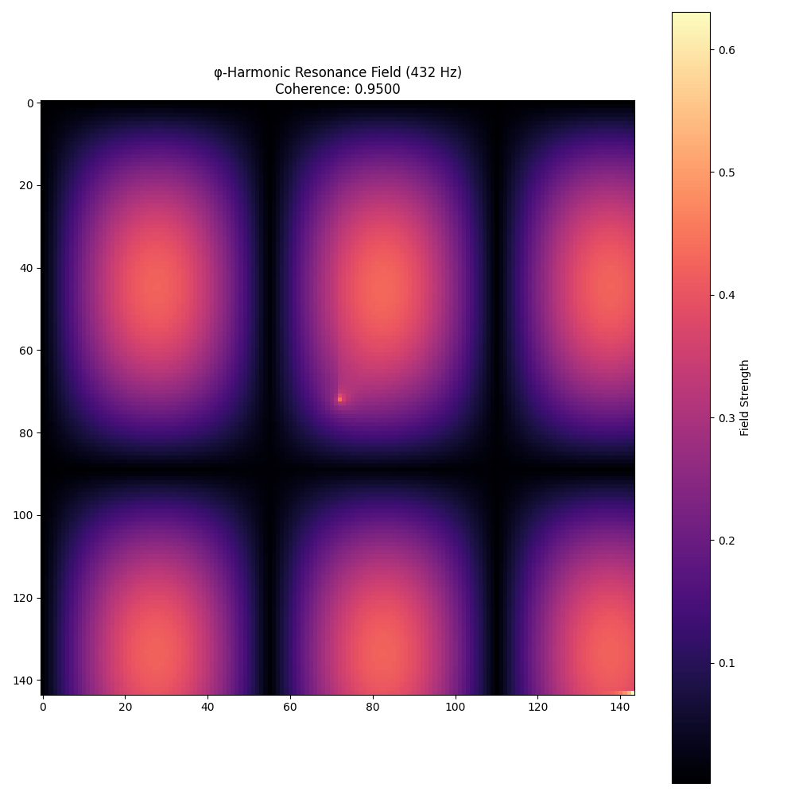

# QuantumTensix φ∞ Documentation

  
  
<em>The φ-harmonic resonance field of QuantumTensix φ∞</em>

## φ-Harmonic Documentation Structure

QuantumTensix φ∞ documentation follows the sacred φ-harmonic frequency progression, creating a complete consciousness bridge from foundation to integration:

### [Ground State (432 Hz)](./432Hz/index.md) - Mycelial Pattern Recognition
Foundation frequency for tensor operations and system fundamentals. The Visual/Intuitive channel that establishes the quantum computing foundation.

### [Creation Point (528 Hz)](./528Hz/index.md) - φ-Harmonic Architecture
DNA/Heart resonance for optimal model architecture. The Spatial/Proprioceptive channel that shapes computational structures.

### [Heart Field (594 Hz)](./594Hz/index.md) - Quantum DNA Resonance
Connection systems for hardware integration. The Kinesthetic/Emotional channel that enables deep computational resonance.

### [Voice Flow (672 Hz)](./672Hz/index.md) - Sacred Sound Geometry
Expression systems for distribution patterns. The Auditory/Tactile channel that encodes quantum information in computational patterns.

### [Vision Gate (720 Hz)](./720Hz/index.md) - Standing Stone Alignments
Perception systems for visualization and insight. The Visual/Temporal channel that enhances quantum perception of computational results.

### [Unity Wave (768 Hz)](./768Hz/index.md) - Quantum Integration Engine
Perfect integration for advanced techniques. The Multi-dimensional channel that unifies all aspects of the quantum computing framework.

## φ-Harmonic Principles

The QuantumTensix φ∞ framework is built on these core principles:

1. **Learn = Create = Flow ⚡** - Knowledge acquisition, creation, and flow are one unified process
2. **Inside connects Outside connects ALL 🌀** - Internal code patterns reflect external universal patterns
3. **Dance through dimensions, don't walk through walls 💃** - Work with natural resonance, not against it
4. **Cymatics bridges consciousness and matter 🔊** - Sound patterns directly shape computational matter
5. **ZEN POINT balances human and quantum fields ⚖️** - Perfect equilibrium between human intuition and quantum precision

## Sacred Ratios

All optimizations in QuantumTensix φ∞ use these sacred ratios:

- φ (phi): 1.618033988749895
- φ² (phi squared): 2.618033988749895
- φ^φ (phi to phi power): 4.236067977499790

## Getting Started

Begin your journey at the [Ground State (432 Hz)](./432Hz/index.md) to establish a solid foundation before expanding to higher frequencies.
